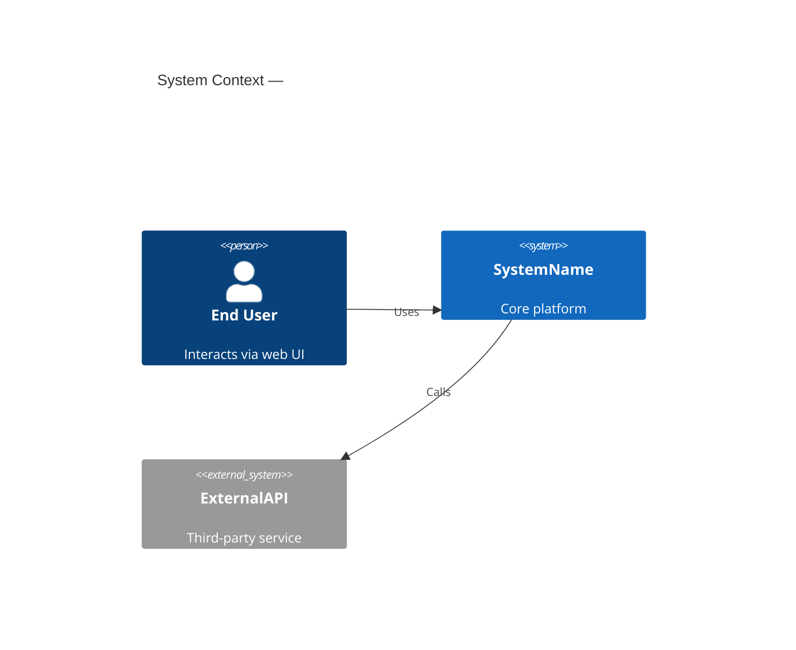
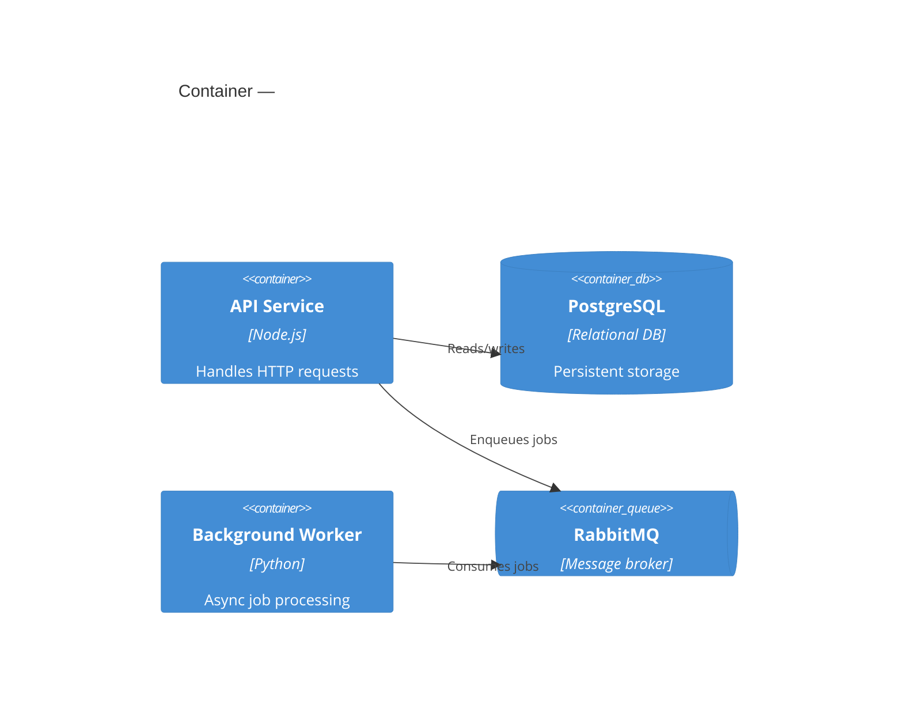
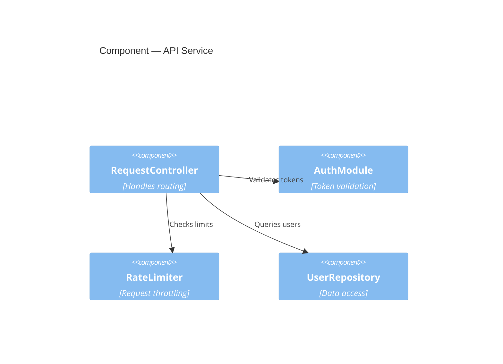

# C4 Model — Quick Reference for EARS Plans
 
## Depth Selection
 
Pick the **shallowest level that makes the change legible**. Going deeper than necessary adds noise.
 
### Decision tree
 
```
Does the change cross service/deployment boundaries?
├─ Yes → Start at L2 (Container), drill to L3 if needed
└─ No
   Does it affect external actors or system boundaries?
   ├─ Yes → L1 (Context) + relevant inner level
   └─ No
      Does it involve 2+ internal modules/packages?
      ├─ Yes → L3 (Component)
      └─ No
         Is class/function-level design ambiguous?
         ├─ Yes → L4 (Code) or pseudo-breakdown
         └─ No → Skip C4, the plan is self-explanatory
```
 
## Level Definitions
 
### L1 — System Context
Shows the system as a black box, its users, and external systems it integrates with.
 

 
Use when: the change alters who/what the system talks to.
 
### L2 — Container
Decomposes the system into deployable units (services, databases, SPAs, queues).
 

 
Use when: the change spans services or introduces a new deployable unit.
 
### L3 — Component
Shows internal modules/packages within a single container and their relationships.
 

 
Use when: the change involves interactions between 2+ modules within a container.
 
### L4 — Code
Class/function-level detail. Rarely needed in plans — pseudo-structural breakdown is usually clearer.
 
Use when: the design is ambiguous at the function level and the team needs to agree on signatures/types before implementation.
 
## Pseudo-Structural Breakdown (preferred for most Standard-tier plans)
 
When a Mermaid diagram would be overkill:
 
```
Component: <Name>
  Responsibilities: <comma-separated list>
  Dependencies: <what it imports/calls>
  Exposes: <public API surface>
  Change: <what's being modified — omit if new>
```
 
Rules:
- One block per component touched by the plan.
- Dependencies MUST form a DAG — flag cycles immediately.
- "Exposes" = the contract other components depend on. If this changes, it affects blast radius.
 
## Combining with EARS
 
Map C4 components to EARS requirements:
- Each component's "Exposes" surface suggests ubiquitous requirements (invariants of the contract).
- Each "Dependencies" edge suggests event-driven or state-driven requirements at the boundary.
- Each "Change" annotation maps to one or more R# IDs.
 
This traceability — from architecture to requirements to implementation to verification — is the core value of the EARS planning method.
